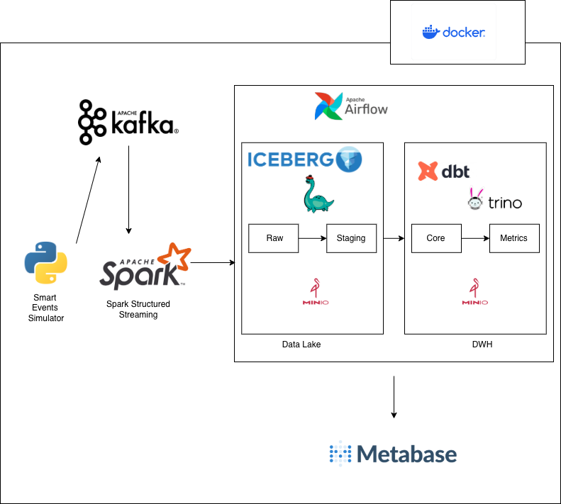
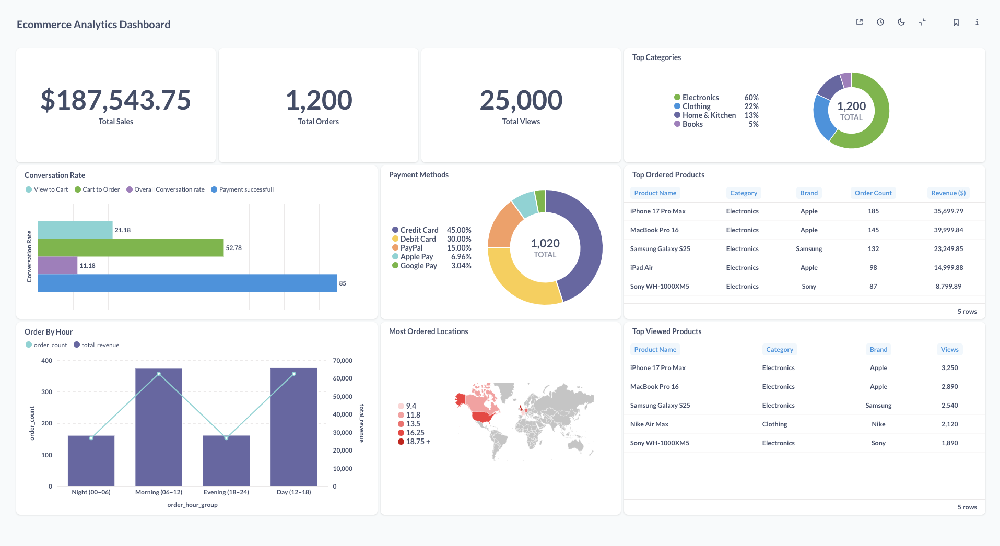

# E-commerce Streaming Lakehouse

Real-time streaming data pipeline for e-commerce analytics using modern data stack.

## Architecture



## Tech Stack

- **Data Generation**: Python Simulator with realistic user journey
- **Message Queue**: Apache Kafka
- **Stream Processing**: Spark Structured Streaming
- **Storage**: MinIO (S3-compatible)
- **Table Format**: Apache Iceberg
- **Catalog**: Nessie (data versioning)
- **Query Engine**: Trino
- **Orchestration**: Apache Airflow
- **Transformation**: dbt
- **Visualization**: Metabase
- **Infrastructure**: Docker

## Data Architecture (Medallion)

### 1. Raw Layer

- Spark Streaming ingests events from Kafka
- Writes to Iceberg tables in MinIO
- Partitioned by `event_date` and `event_type`

### 2. Staging Layer (dbt)

- `stg_product_views` - Product view events
- `stg_cart_additions` - Cart addition events
- `stg_orders` - Order creation events
- `stg_payments` - Payment events
- `stg_order_items` - Order line items

### 3. Core Layer (dbt)

**Dimensions:**

- `dim_users` - User dimension
- `dim_products` - Product dimension
- `dim_locations` - Location dimension

**Facts:**

- `fct_product_views` - Product views
- `fct_cart_additions` - Cart additions
- `fct_orders` - Orders
- `fct_payments` - Payments
- `fct_order_items` - Order items

### 4. Metrics Layer (dbt)

- `agg_conversion_rate` - Conversion funnel metrics
- `agg_total_sales` - Total revenue
- `agg_total_orders` - Total orders
- `agg_revenue_hourly` - Revenue by time of day
- `agg_top_products_viewed` - Most viewed products
- `agg_top_products_ordered` - Best sellers
- `agg_top_categories` - Popular categories
- `agg_payment_methods` - Payment method distribution
- `agg_users_by_locations` - Users by geography

## Quick Start

### Prerequisites

- Docker & Docker Compose
- 16GB+ RAM recommended

### Setup

1. **Clone and navigate to project**

```bash
cd ecommerce-streaming-lakehouse
```

2. **Configure environment variables**

```bash
# Rename all example.env files to .env
find . -name "example.env" -exec sh -c 'mv "$1" "${1%.example.env}.env"' _ {} \;
```

3. **Start all services**

```bash
./manage-lakehouse.sh start
```

This script orchestrates the startup of all services in the correct order:

- Simulator & Kafka
- Storage (MinIO & Nessie)
- Spark Streaming
- Trino
- Airflow
- Metabase

### Access Services

| Service  | URL                    | Description                       |
| -------- | ---------------------- | --------------------------------- |
| Kafdrop  | http://localhost:9009  | Kafka UI                          |
| MinIO    | http://localhost:9000  | Object storage (admin/minioadmin) |
| Nessie   | http://localhost:19120 | Catalog API                       |
| Trino    | http://localhost:8080  | Query engine                      |
| Airflow  | http://localhost:8085  | Workflow orchestration            |
| Metabase | http://localhost:3000  | Analytics dashboard               |

### Run dbt Transformations

1. Access Airflow at http://localhost:8085
2. Trigger `dbt_medalion` DAG
3. Pipeline runs: Staging → Core → Metrics

### Stop Services

```bash
# Stop without removing volumes
./manage-lakehouse.sh stop

# Stop and clean up all data
./manage-lakehouse.sh stop-and-clean-up
```

## Dashboard Example



## Project Structure

```
.
├── simulator/          # Event generator
├── storage/           # MinIO + Nessie
├── spark-streaming/   # Stream processing
├── trino/            # Query engine
├── airflow/          # Orchestration
│   └── dbt_ecommerce/    # dbt project
│       └── models/
│           ├── staging/
│           ├── marts/
│           │   ├── core/
│           │   └── metrics/
├── metabase/         # Visualization
└── manage-lakehouse.sh   # Start/stop script
```

## License

MIT
